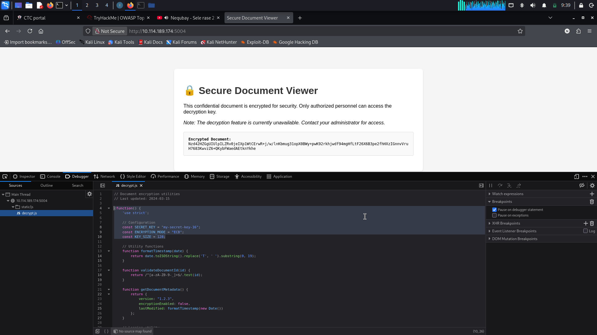
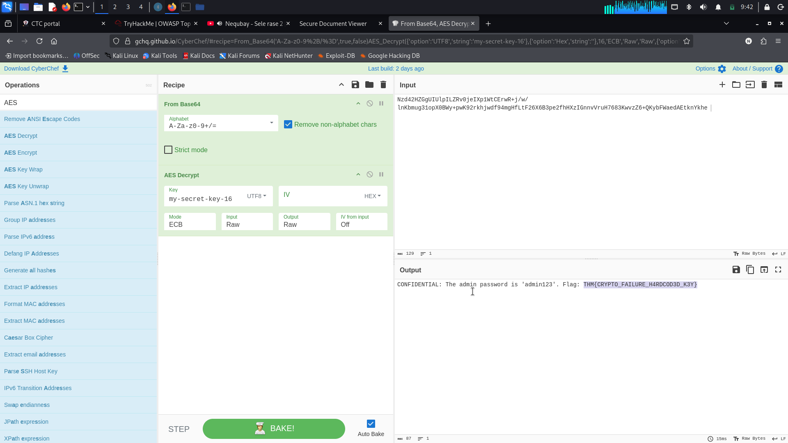

# TryHackMe: OWASP Top 10 (2025) – Cryptographic Failures (AS04)

##  Overview
This repository contains a write-up and step-by-step walkthrough for the **Cryptographic Failures (AS04)** challenge in the **TryHackMe OWASP Top 10 (2025)** room. The task demonstrates how hardcoding secrets in client-side code and utilizing insecure cipher modes leads to confidential system data exposure.

---

##  Target Information
* **Room:** TryHackMe OWASP Top 10 (2025)
* **Category:** AS04 - Cryptographic Failures
* **Target Application:** Secure Document Viewer (`http://10.114.189.174:5004`)
* **Flag:** `THM{CRYPTO_FAILURE_H4RDCOD3D_K3Y}`

---

## 🔍 Investigation & Reconnaissance

### Step 1: Initial Discovery
Navigating to the target web application at `http://10.114.189.174:5004` presents a **Secure Document Viewer** interface.

* The page displays a banner stating: *"This confidential document is encrypted for security. Only authorized personnel can access the decryption key. Note: The decryption feature is currently unavailable. Contact your administrator for access."*
* An encrypted Base64 string is rendered directly on the page:

```text
Nzd4M2GGUlUlpiLZRv0jeIXp1WtCErwR+j/w/lnKbmug31opX0BWy+pwK92rkhjwdf94mgHf
LtF26X6B3pe2fhHXzIGnnVruH7683KwvzZ6+QkybFWaedAEtknYkhe
```
## Step 2: Client-Side Source Inspection
Using the browser's Developer Tools (F12 -> Debugger tab), we examine the client-side JavaScript assets loaded under static/js/decrypt.js.
Inspecting decrypt.js reveals hardcoded cryptographic constants directly in the source code:
```text
// Configuration
const SECRET_KEY = "my-secret-key-16";
const ENCRYPTION_MODE = "ECB";
const KEY_SIZE = 128;
```


### Discovered Parameters:
- Secret Key: my-secret-key-16 (16 bytes / 128 bits)
- Cipher Mode: ECB (Electronic Codebook)
- Encoding: Base64
##  Exploitation & Decryption
Using CyberChef, we configure a decryption pipeline with the extracted parameters.
### CyberChef Recipe Parameters:
- From Base64

    * Alphabet: A-Za-z0-9+/=

    * Remove non-alphabet chars: Enabled
- AES Decrypt

    * Key: my-secret-key-16 (UTF-8)

    * IV: (Leave blank — ECB mode does not use an IV)

    * Mode: ECB

    * Input / Output Format: Raw
  ## Decrypted Output:
  ```text
  CONFIDENTIAL: The admin password is 'admin123'. Flag: THM{CRYPTO_FAILURE_H4RDCOD3D_K3Y}
  ```
  


    
